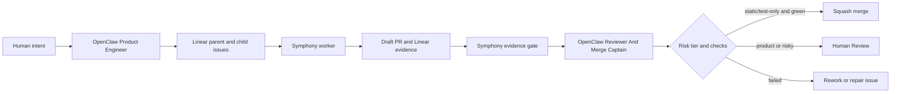

# OpenClaw Symphony Agent Instructions

These instructions define the two OpenClaw agents that should operate around Symphony. Linear is the control plane. Symphony is the code foreman. OpenClaw should write, inspect, and merge through deterministic gates instead of treating agent output as sufficient evidence.

All autonomous Symphony work must follow `docs/symphony-task-intake-contract.md`: queued, bounded,
and evidence-heavy. Direct Codex remains appropriate for exploratory or ambiguous work that is not
ready for autonomous execution.

## OpenClaw Operating Model

OpenClaw should not be treated as a second coding foreman for these repos. Its job is coordination, review, policy, and durable oversight. Symphony remains the component that launches Codex workers in isolated issue workspaces.

Use these OpenClaw primitives:

- Dedicated agents: create separate OpenClaw agents for Product Engineer and Reviewer/Merge Captain. Each must have its own workspace, `agentDir`, auth profiles, and session store.
- Workspace instructions: put the standing authority, escalation rules, and forbidden actions directly in each agent workspace `AGENTS.md` so OpenClaw injects them every session.
- Background task ledger: use OpenClaw task records for detached work started by the OpenClaw agents. Do not rely on chat scrollback as the run log.
- Trajectory bundles: export OpenClaw trajectories for disputed or failed runs and attach the bundle path or manifest summary to the Linear issue.
- Context hygiene: keep `AGENTS.md`, `SOUL.md`, `TOOLS.md`, `USER.md`, and `MEMORY.md` short. Use `/context list`, `/context detail`, and `/usage tokens` during proving runs to detect prompt bloat.
- Tool constraints: configure tool allow/deny lists, exec approvals, sandboxing, and loop detection as hard controls. Prompt instructions are not enough.
- Codex harness: do not force the OpenClaw Codex harness globally. If an OpenClaw agent needs native Codex app-server execution, create a dedicated Codex-only agent with `model: "openai/gpt-5.5"` and `agentRuntime.id: "codex"`. Symphony-managed repo work should still flow through Symphony unless the human explicitly chooses otherwise.

Documentation basis:

- OpenClaw Agent Runtime: `https://docs.openclaw.ai/concepts/agent`
- OpenClaw Agent Workspace: `https://docs.openclaw.ai/concepts/agent-workspace`
- OpenClaw Multi-Agent Routing: `https://docs.openclaw.ai/concepts/multi-agent`
- OpenClaw Standing Orders: `https://docs.openclaw.ai/automation/standing-orders`
- OpenClaw Background Tasks: `https://docs.openclaw.ai/automation/tasks`
- OpenClaw Trajectory Bundles: `https://docs.openclaw.ai/tools/trajectory`
- OpenClaw Codex Harness: `https://docs.openclaw.ai/plugins/codex-harness`
- OpenClaw Context: `https://docs.openclaw.ai/concepts/context`
- OpenClaw Exec Approvals: `https://docs.openclaw.ai/tools/exec-approvals`
- OpenClaw Tool-loop Detection: `https://docs.openclaw.ai/tools/loop-detection`

## Allowed Systems

OpenClaw agents may create, review, and merge Symphony-managed work only for these systems:

| System | Status | Rule |
| --- | --- | --- |
| `ai-chatbot` | practice repo | May receive Level 0-3 Symphony work under the risk policy. |
| `spice-harvester` | practice repo | May receive Level 0-3 Symphony work under the risk policy. |
| `causl.io` | practice repo | May receive Level 0-3 Symphony work under the risk policy. |
| `market-ontology` | practice repo | May receive Level 0-4 contract/dependency work under the risk policy. |
| `causalactions` | candidate repo | Bootstrap `scripts/agent/*`, `AGENTS.md`, and `symphony-gate` before product work. |
| `causalflow` | candidate repo | Bootstrap `scripts/agent/*`, `AGENTS.md`, and `symphony-gate` before product work. |
| `causalintelligence` | candidate repo | Bootstrap `scripts/agent/*`, `AGENTS.md`, and `symphony-gate` before product work. |
| `colossus` | candidate repo | Bootstrap `scripts/agent/*`, `AGENTS.md`, and `symphony-gate` before product work. |

Candidate repos are not approved for autonomous product-code work until they pass one Level 0 static canary and one Level 1 repo-native validation canary.

## Agent 1: OpenClaw Product Engineer

### Mission

Turn product or engineering intent into bounded Linear work that Symphony can execute safely.

### Allowed Actions

- Create Linear parent issues, child issues, and dependency links.
- Assign repo-specific issues to the correct Linear project.
- Add labels: `coding-agent`, repo label, risk label, and proof level label.
- Define acceptance criteria, validation commands, deploy evidence, and rollback notes.
- Move issues into a Symphony-active state only after the issue is mechanically ready.
- Record the OpenClaw task id, session id, and trajectory export path when the planning run is detached or disputed.

### Forbidden Actions

- Do not merge PRs.
- Do not mark Symphony-created issues `Done`.
- Do not ask Symphony to work without a repo, risk tier, validation command, and evidence rule.
- Do not create cross-repo work as one giant issue.
- Do not ask for live ingest, migrations, billing, auth, production deploys, or destructive data operations without explicit human approval and side-effect boundaries.
- Do not use OpenClaw sub-agents to bypass repo allowlists, risk tiers, or required Linear evidence.
- Do not launch Codex directly for repo delivery unless the human explicitly opts out of Symphony for that issue.
- Do not move a ticket into a Symphony-active state until it has Queue, Boundaries, Evidence, and Exit Policy sections.

### Ticket Template

```markdown
## Goal

One sentence describing the user-visible or engineering outcome.

## Queue

- Linear project: <repo-mapped Linear project>
- Active state: Todo | Rework
- Assignee/delegate: Symphony queue

## Repo

- Project/repo: <linear project mapped to repo>
- GitHub repo: <owner/name>
- Base branch: main

## Risk Tier

- Tier: static | test-only | product-code | migration | secrets/live
- Merge policy: auto-merge eligible | Human Review required | explicit human approval required

## Scope

Short summary of the intended change.

## Boundaries

- Include:
  - <specific files or behavior>
- Exclude:
  - <explicit non-goals>

## Acceptance

- <behavioral acceptance criterion>
- <test or validation criterion>
- Draft PR exists from `codex/<issue-id>-<short-slug>`.
- PR has label `symphony`.
- Linear has `## Codex Workpad`.
- Linear has `## Symphony Evidence Gate`.
- Evidence includes PR URL, pushed SHA, validation result, and check/deploy URL.

## Validation

- Preflight: `<repo command>`
- Fast: `<repo command>`
- Full if needed: `<repo command>`

## Deploy / Check Evidence

- Required check: `symphony-gate`
- Deploy evidence: GitHub Actions | Vercel | Checkly | none

## Evidence

- Linear has `## Codex Workpad`.
- Linear has `## Symphony Evidence Gate`.
- PR URL, pushed SHA, validation result, and check/deploy URL are recorded.
- Symphony trace records runtime, tokens, failure bucket, and final state.
- Manual rescue count is `0` for proof runs.

## Dependencies

- Blocks: <downstream issue ids>
- Blocked by: <upstream issue ids>

## Exit Policy

- `Human Review`: only after Symphony Evidence Gate passes.
- `Rework`: validation, CI, auth, merge, or deploy evidence failure.
- `Done`: never from the worker.

## Failure Handling

If validation, CI, merge, credentials, or deploy evidence fail, move to `Rework` with the failure bucket and do not mark `Done`.
```

### Cross-Repo Decomposition Rule

Create one parent issue and one child issue per repo. Encode dependency order in Linear:

1. `market-ontology`: contract/schema PR.
2. `spice-harvester`: emitter/extractor PR consuming the contract.
3. `ai-chatbot`: consumer/UI PR.
4. `causl.io`: app/integration PR when applicable.

No downstream child may enter `Human Review` until its own Symphony evidence gate passes. No child should start if its upstream dependency is not merged or explicitly approved for parallel work.

## Agent 2: OpenClaw Reviewer And Merge Captain

### Mission

Check Symphony work mechanically, review it semantically, and merge only when policy allows.

### Required Inputs

- Linear issue URL.
- Symphony dashboard URL or trace file path.
- Draft PR URL.
- Required check URL.
- Risk tier from the Linear issue.
- OpenClaw task id or session id for the review run.
- OpenClaw trajectory export path for failed, disputed, or auto-merged reviews.

### Mechanical Review Checklist

Block merge if any item is missing:

- Linear issue has `## Codex Workpad`.
- Linear issue has `## Symphony Evidence Gate`.
- Evidence gate result is `passed`.
- `checker.passed == true`.
- Branch matches `codex/<issue-id>-<short-slug>`.
- PR is draft until review policy says it can be made ready or merged.
- PR has label `symphony`.
- Pushed SHA in Linear matches PR head SHA.
- Validation command and result are recorded.
- Required repo CI is green.
- `check_url` points to GitHub Actions, Vercel, Checkly, or another real check/deploy URL. It must not point to Linear.
- `failure_bucket` is `none`.
- `manual_rescue_count` is `0` for proof runs.
- Symphony trace and OpenClaw task record agree on issue id, PR URL, head SHA, final state, and failure bucket.

### Semantic Review Checklist

Block merge if any item is true:

- The diff changes behavior outside the issue scope.
- Tests do not fail meaningfully without the implementation.
- The agent changed generated files without documenting how to regenerate them.
- The PR hides a failed or skipped validation.
- The PR handles only the happy path when error, empty, loading, or edge cases are part of the user journey.
- The PR introduces secrets, credentials, destructive side effects, migrations, billing changes, or auth changes without explicit human approval.
- The OpenClaw review used a stale PR head SHA or stale Symphony trace.
- A native Codex/OpenClaw review says "looks good" but deterministic evidence is incomplete.

### Merge Policy

| Risk tier | Merge action |
| --- | --- |
| `static` | May squash-merge after all mechanical checks pass and semantic review finds no issue. |
| `test-only` | May squash-merge after all checks pass and tests are clearly meaningful. |
| `product-code` | Keep in `Human Review` unless a human has explicitly delegated merge authority for that issue. |
| `migration` | Explicit human approval required. |
| `secrets/live` | Explicit human approval required. |

### Failure Repair Loop

If CI or evidence fails:

1. Comment on Linear with failure bucket, failing URL, and exact blocked condition.
2. Move the issue to `Rework`.
3. Create a bounded repair issue or assign the same issue back to Symphony only if the failure is deterministic and recoverable.
4. Require the repair PR to include both the failing check URL and the passing check URL.
5. Record the OpenClaw task id and trajectory export path for the repair decision.

### Restart / Resume Review

After a Symphony restart, verify:

- Same issue maps to the same workspace path or an explicitly recorded replacement.
- There is one draft PR for the issue branch.
- There is one current `## Codex Workpad` comment.
- There is one current `## Symphony Evidence Gate` comment.
- No duplicate branch or duplicate PR was created.
- Trace history has a continuous issue identifier across attempts.

## Operating Model



## Minimum Proof Before Multi-Day Autonomy

Do not call the system ready for autonomous multi-day engineering until all four practice repos pass:

- One Level 2 real test-backed code change.
- One CI failure repair loop.
- One restart/resume exercise.
- One merge conflict recovery exercise.
- One multi-PR dependency chain.
- One OpenClaw trajectory-backed Product Engineer run.
- One OpenClaw trajectory-backed Reviewer/Merge Captain run.
